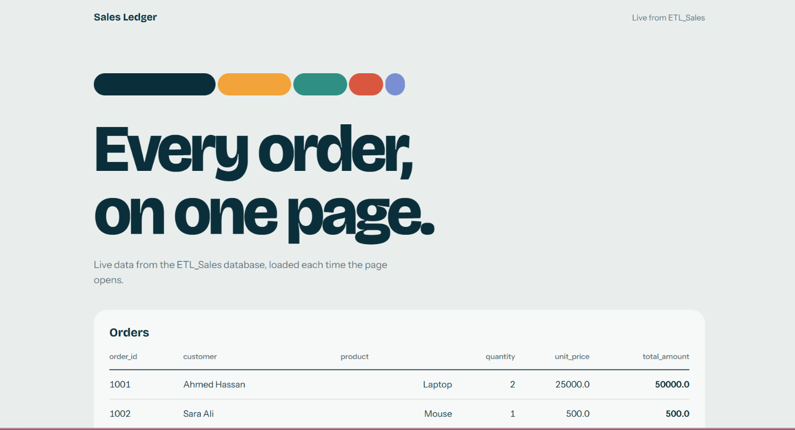

# ETL Sales Pipeline + Flask Dashboard

An end-to-end data project: extract data from three sources, clean and merge it with Python, load the result into **SQL Server**, and display it on a **Flask** dashboard.



## How it works

```
customers.csv ──► clean ─┐
orders.parquet ─► clean ─┼─► merge ─► sales.csv ─► SQL Server (Sales table) ─► Flask dashboard
products.csv ───► clean ─┘                                                      (HTML + CSS)
 (downloaded from an API)
```

| Step | Notebook | What it does |
|------|----------|--------------|
| 1. Extract and clean | `Extract_Clean.ipynb` | Downloads the products file, cleans the three datasets, merges them and writes `sales.csv` |
| 2. Load | `SQL_Loading.ipynb` | Creates the `Sales` table in SQL Server and inserts the rows from `sales.csv` |
| 3. Display | `app.ipynb` | Runs a Flask app that reads the `Sales` table and renders it as a web page |

## Data sources

- `customers.csv` (local file)
- `orders.parquet` (local file)
- `products.csv`, downloaded with `requests` from [this API link](https://raw.githubusercontent.com/MohammedHameds/test1455/refs/heads/main/products.csv)

## Transformations

**Customers**
- Removed duplicates, matching on first name, last name and email
- Standardized `city` (trimmed whitespace, title case), so `cairo` becomes `Cairo`
- Validated `age`: converted to numeric and kept ages from 5 to 100
- Filled missing emails with `unknown@email.com`
- Created `full_name` from first and last name

**Orders**
- Removed duplicate `order_id` values
- Validated `quantity`: converted to numeric and kept only values above 0
- Converted `order_date` to datetime
- Validated `customer_id`: remapped the duplicate customer record (ID 5 to ID 1) and kept only orders whose customer exists in the cleaned customers table

**Products**
- Removed duplicate rows
- Standardized `product_name` and `category` (trimmed whitespace, title case)
- Validated `unit_price`: converted to numeric and kept only prices above 0

**Sales**

The three cleaned datasets are inner-merged (orders with customers, then with products), and the total is calculated:

```python
sales["total_amount"] = sales["quantity"] * sales["unit_price"]
```

Final columns: `order_id`, `customer`, `product`, `quantity`, `unit_price`, `total_amount`

## SQL Server table

```sql
CREATE TABLE Sales (
    order_id     INT,
    customer     VARCHAR(50),
    product      VARCHAR(50),
    quantity     INT,
    unit_price   FLOAT,
    total_amount FLOAT
)
```

`SQL_Loading.ipynb` drops and recreates this table on each run, so reloading never duplicates rows.

## Dashboard

The Flask app connects to SQL Server, reads the `Sales` table with pandas, and renders it in an HTML template styled with a separate CSS file.

## Project structure

```
.
├── Extract_Clean.ipynb
├── SQL_Loading.ipynb
├── app.ipynb
├── customers.csv            # raw input
├── orders.parquet           # raw input
├── products.csv             # downloaded from the API
├── clean_customers.csv      # cleaned output
├── cleaned_orders.csv       # cleaned output
├── cleaned_products.csv     # cleaned output
├── sales.csv                # final merged table
├── templates/
│   └── index.html
├── static/
│   └── style.css
└── README.md
```

## Requirements

- Python 3.10+
- SQL Server (Express is fine) with a database named `ETL_Sales`
- [ODBC Driver 17 for SQL Server](https://learn.microsoft.com/sql/connect/odbc/download-odbc-driver-for-sql-server)
- Python packages:

```bash
pip install pandas pyarrow requests pyodbc flask
```

## How to run

1. Create the database `ETL_Sales` in SQL Server.
2. Make sure `customers.csv` and `orders.parquet` are in the project folder.
3. Run `Extract_Clean.ipynb` to clean and merge the data and produce `sales.csv`.
4. Run `SQL_Loading.ipynb` to load `sales.csv` into the `Sales` table.
5. Run the cells in `app.ipynb` to start the Flask server.
6. Open <http://127.0.0.1:5001> in your browser.

## Connection settings

The notebooks connect with Windows authentication:

```python
pyodbc.connect(
    "driver={ODBC Driver 17 for SQL Server};"
    "server=localhost\\SQLEXPRESS;"
    "database=ETL_Sales;"
    "trusted_connection=yes;"
)
```

If your server name is different, change `server=` in `SQL_Loading.ipynb` and `app.ipynb`.

## Tech stack

Python, pandas, requests, pyodbc, SQL Server, Flask, HTML, CSS
